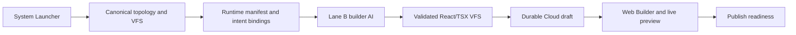

# Unison Tasks

**Unison Framework is a source-backed AI website and business-workspace platform.** It turns a guided business brief into a React/TypeScript project, preserves the generated source in a cloud workspace, and provides a visual builder, live preview, publishing readiness, and intent-driven business actions.

## What Unison Does

Unison is designed around a durable build contract rather than a one-off AI response:

- **System Launcher** captures business type, goals, template composition, and visual direction.
- **Canonical launch pipeline** creates the site topology, routes, runtime manifest, and React/TSX VFS before handoff.
- **Lane B builder AI** authors full page bodies through the authenticated `ai-code-assistant` Edge Function using task-specific provider routing.
- **Web Builder** loads and edits the same multi-page VFS used by the preview runtime.
- **Cloud workspace** persists projects and source-backed drafts so work can be reopened and recovered.
- **Fixed intent system** binds approved actions such as booking, lead capture, checkout, and navigation at build time.
- **Preview and publish readiness** validate generated source rather than silently substituting placeholder pages.

## Framework Contract

Every launched project has three independent layers:

| Layer | Owns | Does not own |
| --- | --- | --- |
| `SystemBlueprint` | Business type, goals, pages, workflows, intent contracts | Layout and visual styling |
| `TemplateStructure` | Page composition, section order, navigation, layout density | Business behavior and theme tokens |
| `ThemeSkin` | Color, typography, spacing, shape, motion | Page structure and intent bindings |

The launch contract is:

```text
template structure -> intent wiring -> theme override -> canonical build -> AI page authoring
```

Theme selection changes presentation only. It does not replace topology, page contracts, or business actions.

## Launch Lifecycle



1. The launcher resolves an industry, composition, theme preset, pages, and allowed intents.
2. The canonical pipeline compiles a source-backed VFS plus `.unison` metadata, runtime manifest, and navigation contracts.
3. Lane B generates the page implementation against that contract. Minimal fallback pages are intentionally blocked when generation fails.
4. The complete VFS is saved to `builder_drafts` and linked to the workspace project before the builder handoff.
5. The Web Builder restores the project from durable source and renders it through the preview runtime.

The Style card is required. Its resolved semantic HSL tokens are injected into
the wizard seed and `WizardSelections`; Stage 4b builds `/src/index.css`
directly from that payload. Preset identifiers are trace metadata only and are
not used to reconstruct launch colors. Lane B output containing hardcoded hex,
raw color functions, or Tailwind palette colors is rejected rather than merged.

Topology is planned once inside the canonical pipeline. That same
`GeneratedSitePlan` populates the PageRegistry and is returned for launcher
audits, persistence, and Builder handoff, keeping page IDs aligned end-to-end.
Lane B owns registered page bodies, the SiteBundleSnapshot owns topology,
router and bindings, and Stage 4b owns `/src/index.css`.

## Core Architecture

| Area | Current implementation |
| --- | --- |
| Application | React 19, TypeScript 5.9, Vite 7, React Router 7 |
| UI and state | Tailwind, Radix UI, TanStack Query, React Context |
| Builder | Monaco, CodeMirror, Fabric, shared virtual file system |
| Preview | Sandpack browser preview with optional Docker/Vite preview service |
| Backend | Supabase Auth, Postgres, RLS, Realtime, and Deno Edge Functions |
| AI | Authenticated `ai-code-assistant` orchestration with direct provider routing and task-aware model selection |
| Automation | Inngest events and workflow endpoints for business actions |
| Deployment | Vercel application deployment; Supabase deploys database and Edge Function infrastructure |--

### Source Is the Product State

The canonical deliverable is a React/TSX virtual file system, not HTML text or an in-memory wizard result. Generated projects include application source under `/src`, public assets, project configuration, and Unison runtime metadata under `/.unison`.

The builder and preview share this source model. A launch or edit that cannot produce valid, renderable source is surfaced as an error rather than converted into a generic placeholder site.

### Intent Safety

Project actions use a closed catalog of business intents. The build process annotates the generated UI with approved intent bindings; runtime code resolves those bindings to fixed action handlers. Templates cannot invent arbitrary runtime actions.

### Cloud Recovery

Cloud projects are backed by `businesses`, `projects`, `builder_drafts`, and canonical site revisions. The Cloud workspace distinguishes source-backed projects that can be previewed from metadata-only historical records that need source recovery.

## Repository Layout

```text
src/
  components/onboarding/   System Launcher and launch controls
  components/creatives/    Web Builder surfaces
  components/cloud/        Cloud workspace and project recovery UI
  platform/core/           Topology, industry, intent, and canonical pipeline
  services/                VFS, launch, preview, persistence, and publish services
  contexts/                Launch and VFS state providers

supabase/
  functions/               Deno Edge Functions, including ai-code-assistant
  migrations/              Database schema and RLS migrations

api/                       Vercel API and Inngest endpoints
preview-service/           Optional Docker/Vite preview runtime
docs/                      Architecture, setup, operations, and integration guides
scripts/                   Local setup, deployment, and infrastructure helpers
```

## Local Development

### Prerequisites

- Node.js `>=20 <23`
- npm or Bun
- A Supabase project for authentication, persistence, and Edge Functions
- Docker Desktop only when using the optional containerized preview runtime
- Supabase CLI when running the local stack, applying migrations, or deploying functions

### Install and Run

```bash
git clone https://github.com/Invictusprime7/unison-tasks-official.git
cd unison-tasks-official
npm install

# Copy the public client configuration template, then add your own values.
cp .env.example .env.local

npm run dev
```

Vite prints the local URL after startup. The application can use a configured remote Supabase project during ordinary frontend development. Use the Supabase CLI only when you need a local backend stack or infrastructure changes.

### Environment Configuration

Use [`.env.example`](.env.example) as the reference. The browser requires only public Supabase configuration:

| Variable | Purpose |
| --- | --- |
| `VITE_SUPABASE_URL` | Supabase project URL |
| `VITE_SUPABASE_PUBLISHABLE_KEY` | Browser-safe Supabase publishable/anon key |
| `VITE_PREVIEW_GATEWAY_URL` | Optional local Docker preview gateway |

Keep provider and privileged keys server-side. Configure `OPENAI_API_KEY`, `GEMINI_API_KEY`, `ANTHROPIC_API_KEY`, and `SUPABASE_SERVICE_ROLE_KEY` as Supabase Edge Function secrets or equivalent server-only environment variables. Never expose them with a `VITE_` prefix.

### Local Supabase and Preview Runtime

```bash
# Optional: run the local Supabase stack and apply migrations.
npx supabase start
npx supabase db push

# Optional: run the Docker preview runtime.
npm run preview:docker:start
npm run preview:docker:status
```

## Common Commands

```bash
# Application validation
npm run lint
npm run type-check
npm run build

# Local application and preview
npm run dev
npm run preview
npm run preview:docker:start
npm run preview:docker:stop
npm run preview:docker:status

# Automation development
npm run inngest:dev
npm run automation:dev

# Deployments
npm run deploy             # Vercel production deployment
npm run deploy:preview     # Vercel preview deployment
supabase functions deploy ai-code-assistant --use-api
```

## Operating Principles

- **React/TSX only:** the build and preview pipeline accepts source-backed React projects, not HTML-only generation.
- **One VFS per builder:** editor, AI actions, autosave, and preview operate on the same project source.
- **Durable before navigation:** launcher-generated source is persisted before redirecting into the builder.
- **Strict generation failures:** the wizard does not mask Lane B failures with a generic site fallback.
- **Authenticated Edge Functions:** browser calls use Supabase auth and production CORS policy.
- **No client secrets:** provider and service-role credentials stay in server-side configuration.

## Documentation

| Guide | Focus |
| --- | --- |
| [Architecture](docs/ARCHITECTURE.md) | Historical and detailed system architecture notes |
| [AI setup](docs/AI_SETUP_GUIDE.md) | AI provider and key setup |
| [AI template troubleshooting](docs/AI_TEMPLATE_TROUBLESHOOTING.md) | Generation diagnostics and repair guidance |
| [Build to canvas workflow](docs/BUILD_TO_CANVAS_WORKFLOW.md) | Builder and preview workflow details |
| [Preview runtime](docs/PREVIEW_RUNTIME_ARCHITECTURE.md) | Preview runtime architecture and operations |
| [VFS preview](docs/VFS_PREVIEW_ARCHITECTURE.md) | VFS and Sandpack integration |
| [Universal intent system](docs/UNIVERSAL_INTENT_SYSTEM.md) | Intent contracts and fixed action execution |
| [Automation recipes](docs/AUTOMATION_RECIPES_ENGINE.md) | Workflow recipe engine |
| [CRM pipeline automation](docs/CRM_PIPELINE_AUTOMATION.md) | CRM workflows and pipeline automation |
| [Inngest CRM setup](docs/INNGEST_CRM_SETUP.md) | Inngest and CRM integration |
| [Stripe setup](docs/STRIPE_SETUP.md) | Payment configuration |
| [CRM schema reference](docs/CRM_SCHEMA_DEPLOYMENT.sql) | CRM database schema deployment reference |
| [Vercel environment setup](docs/vercel-env-setup.md) | Production environment configuration |

## Security

Supabase RLS controls access to workspace data. Edge Functions validate authenticated requests and maintain CORS allowlists for browser clients. Keep deploy-time credentials and AI provider keys out of the browser bundle, and run the validation commands before deploying changes.

## License

This project is licensed under the [MIT License](LICENSE).
